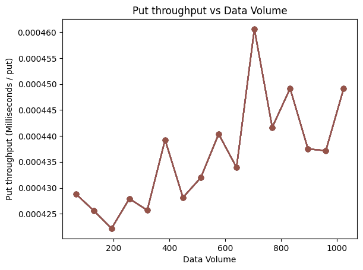
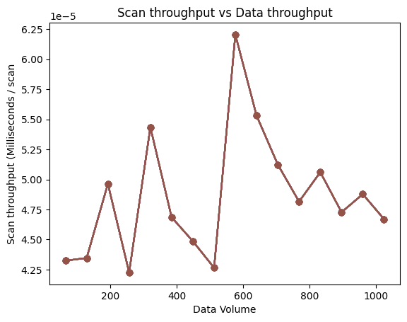
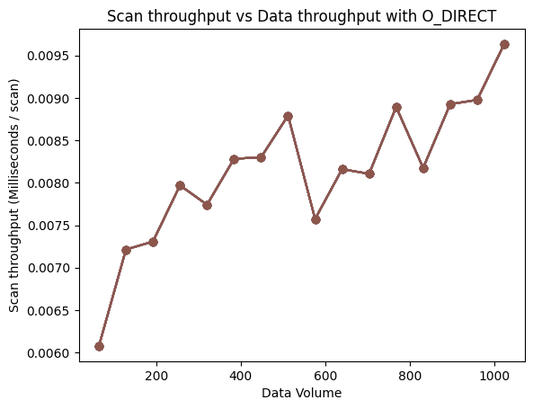
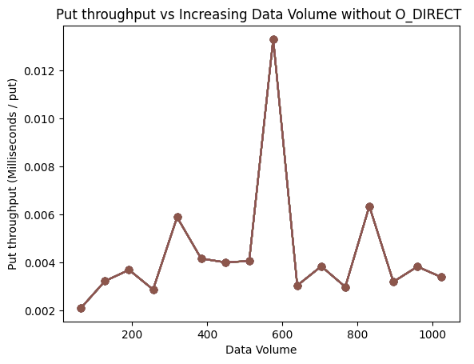
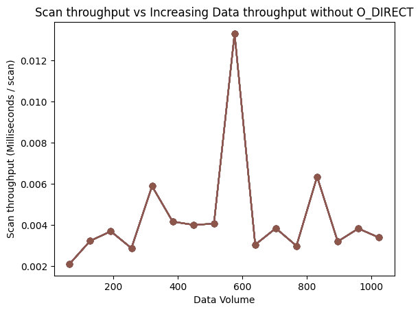

<!-- Experiments  -->

# Step 1 Experiments

### Experiment 1: Put throughput vs Data Volume


### Experiment 2: Get throughput vs Data Volume


### Experiment 3: Scan throughput vs Data Volume


# Step 2 Experiment

### Experiment 4: LRU vs Clock

# Step 3 Experiment 1 with O_DIRECT Flag

### Experiment 6: Put throughput vs Increasing Data Volume


### Experiment 7: Get throughput vs Increasing Data Volume 


### Experiment 8: Scan throughput vs Increasing Data Volume


# Step 3 Experiment 2 

### Experiment 9: Get performance for changing bloom filter bits with growing data size


# Step 3 Bonus Experiment without O_DIRECT Flag

### Experiment 10: Put throughput vs Increasing Data Volume


### Experiment 11: Get throughput vs Increasing Data Volume 


### Experiment 12: Scan throughput vs Increasing Data Volume



<!-- Testing -->

# Unit tests

Testing the functionality of our database intially ended up being very fruitful, as we updated the database with more features through the steps we used both unit and integration tests to make sure our code worked. 
We used unit tests for `AVL.cpp` and integration tests for `Database.cpp`. 


<!-- Compilation & running instructions -->

# Compilation and running instructions 

### Running main code
```
./build.sh
./run_src.sh
```

### Running tests
```
./build.sh
./run_test.sh
```

### Running experiments
```
./build.sh
./run_experiments/step1_exp1.sh
./run_experiments/step3_exp1.sh
./run_experiments/step3_exp2.sh
```