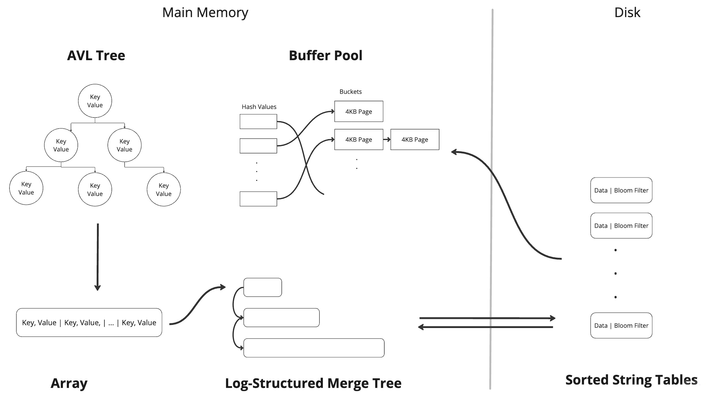

# Key-Value Store

A highly configurable disk-based persistent Key-Value store written in C++ that supports get, put, delete, and range scan operations. It utilizes various components like Log-Structured Merge Tree with Bloom Filters, customizable Buffer Pool (with 2 eviction policies) and AVL Tree to enhance get and put throughputs. 



## Requirements

* [CMake](https://cmake.org/install/) v3.24
* make

## Installation
```
git clone --recursive https://github.com/ranachirag/key-value-store.git
cd key-value-store
```

### Docker
```
docker build -t key-value-store .
docker run -it key-value-store
git clone --recurse-submodule https://github.com/ranachirag/key-value-store.git
cd key-value-store
```

## Build
```
rm -rf ./build
cmake -B ./build -S . -DCMAKE_TOOLCHAIN_FILE=./vcpkg/scripts/buildsystems/vcpkg.cmake
( cd ./build ; make all )
```

## Run 
```
./build/src/kvstore_run
```

## Usage

```c++
#include <string>

#include "DatabaseMacros.h"
#include "Database.h"

int main() {
  DatabaseOptions db_options;
  db_options.use_buffer_pool = true;                       // Use a Buffer Pool

  BufferPoolOptions buf_options;
  buf_options.initial_size = 1024;                         // 1024 buckets initial capacity of Buffer Pool
  buf_options.max_size = 4096;                             // 4096 buckets can hold 4096 frames of 4kB which is 16 MB
  buf_options.max_size_bytes = NUM_BYTES_MB * 10;          // 10 MB Buffer Pool size limit
  buf_options.evict_policy = CLOCK_EVICT;                  // or LRU_EVICT for LRU Eviction

  db_options.buffer_pool_options = buf_options;

  db_options.use_bloom_filters = true;                     // Use Bloom Filters

  BloomFilterOptions bloom_filter_options;
  bloom_filter_options.parameter_setting = BITS_PER_ENTRY; // or FALSE_POSITIVE_RATE
  bloom_filter_options.bits_per_entry = 5;                 // 5 bits per entry for the Bloom Filter

  db_options.bloom_filter_options = bloom_filter_options;  

  db_options.memtable_size = NUM_BYTES_MB * 1;             // Memtable is 1 MB 
  db_options.sst_structure = LIST_SST;                     // LST_SST the only option available
  db_options.storage_structure = LSM_TREE_STORAGE;         // or APPEND_ONLY_STORAGE

  Database *kv_store = new Database(db_options);
  
  std::string db_name = "my_db";
  kv_store->open(db_name);
  
  kv_store->put(123, 10);
  
  long val = kv_store->get(123);
  
  std::vector<std::pair<long, long>> lst;
  int num_results = kv_store->scan(lst, 0, 100);
  

  kv_store->close();

}
```

## Generate Documentation

- Install [doxygen](https://doxygen.nl/download.html)

```
doxygen Doxyfile
open ./html/index.html
```

## Collaborators

* Chirag Rana
* Rutav Shah
