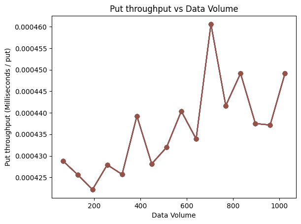
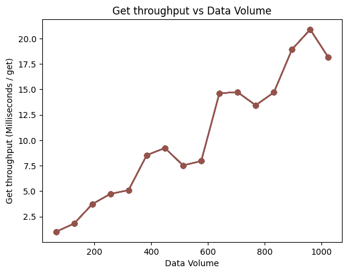
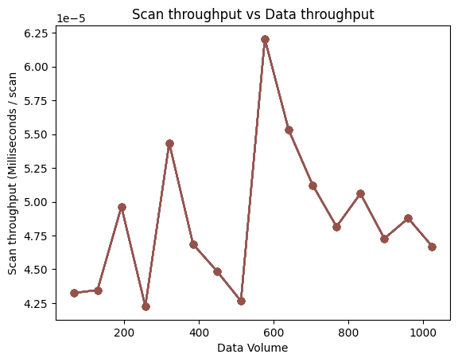
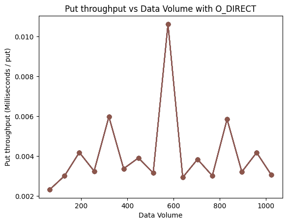
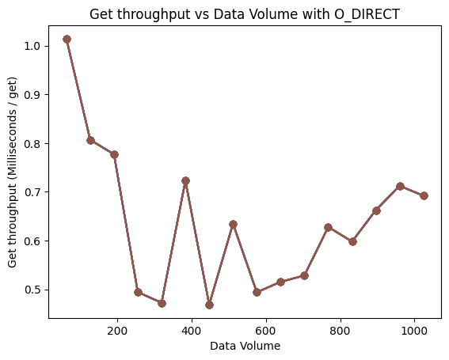
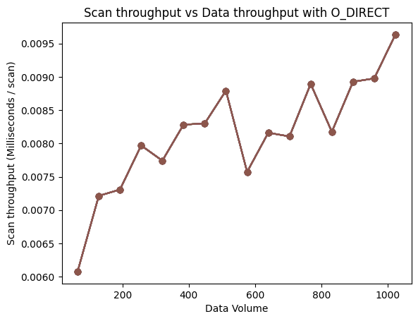
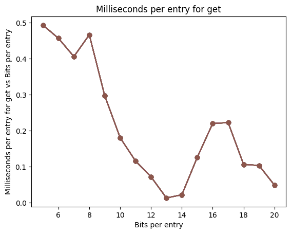
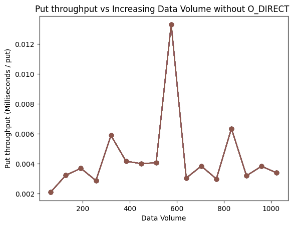
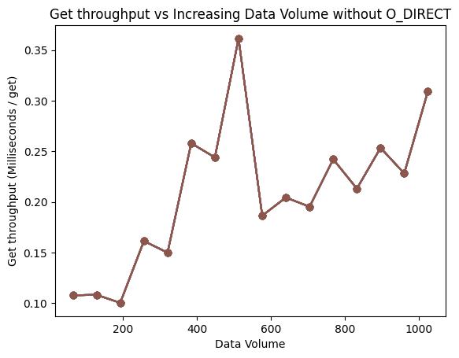
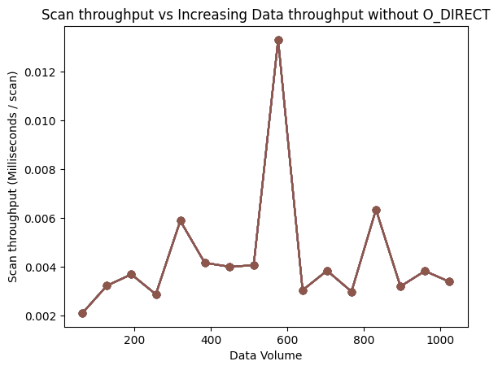

# Key-Value Store

## Design

### Database

The Database object exposes all the elements of the Key-Value store to the users. The user can insert, get, and scan Key-Value pairs (both 8-byte integers) and tune the database paramters. 

The first step is to open a database by giving it a name. Once you are done, the database must be closed. (**Note:** Only one database should be open at any given time).

The following configuration options are available to the user:

```
#include <string>

#include "DatabaseMacros.h"
#include "Database.h"

int main() {
  DatabaseOptions db_options;
  db_options.use_buffer_pool = true;                       // Use a Buffer Pool

  BufferPoolOptions buf_options;
  buf_options.initial_size = 1024;                         // 1024 buckets initial capacity of Buffer Pool
  buf_options.max_size = 4096;                             // 4096 buckets can hold 4096 frames of 4kB which is 16 MB
  buf_options.max_size_bytes = NUM_BYTES_MB * 10;          // 10 MB Buffer Pool size limit
  buf_options.evict_policy = CLOCK_EVICT;                  // or LRU_EVICT for LRU Eviction

  db_options.buffer_pool_options = buf_options;

  db_options.use_bloom_filters = true;                     // Use Bloom Filters

  BloomFilterOptions bloom_filter_options;
  bloom_filter_options.parameter_setting = BITS_PER_ENTRY; // or FALSE_POSITIVE_RATE
  bloom_filter_options.bits_per_entry = 5;                 // 5 bits per entry for the Bloom Filter

  db_options.bloom_filter_options = bloom_filter_options;  

  db_options.memtable_size = NUM_BYTES_MB * 1;             // Memtable is 1 MB 
  db_options.sst_structure = LIST_SST;                     // LST_SST the only option available
  db_options.storage_structure = LSM_TREE_STORAGE;         // or APPEND_ONLY_STORAGE

  Database *kv_store = new Database(db_options);
  
  std::string db_name = "my_db";
  kv_store->open(db_name);
  
  kv_store->put(123, 10);
  
  long val = kv_store->get(123);
  
  std::vector<std::pair<long, long>> lst;
  int num_results = kv_store->scan(lst, 0, 100);
  

  kv_store->close();

}
```

### Main Memory - Memtable

The Memtable in an interface for accessing and storing Key-Value pairs in main memory.

The Memtable is implemented using an AVL tree data structure. The Nodes in the AVL tree contain the Key and Value. The following functions are supported:

* **Insert** Key-Value pair
* **Search** for a Value given Key
* **Range scan** for all Key-Value pairs given a range of two Keys
* **Update** Value for a given Key (Note: only supported for LSM Tree)
* **Clear** AVL tree

All Key-Value pairs are first inserted into the AVL tree, as the AVL tree reaches a certain threshold, the data is flushed to Disk Memory for storage and the AVL tree is cleared.

* ***Location:***
  * [Header File](./include/AVL.h)
  * [Implementation file](./src/AVL.cpp)

### SST 

```SST``` objects represent an interface for interacting with SST (Sorted String Table) files. A ```SST``` object is created for each SST file and the following functionality is supported:

* **Write** Key-Value pairs to the SST file (in units of 4 KB blocks)
  * As the Key-Values are written to disk, if the [Bloom Filter](#bloom-filters) option is configured, the Keys are inserted into the corresponding Bloom Filter for the SST file
* **Search** for a Key in the corresponding SST file, implemented using Binary search
  * First, Binary search over the SST file (in units of 4 KB blocks) to find the block containing the key
  * Binary search over the block containing the key
  * If configured, the Buffer Pool is checked first 
* **Scan** SST file to search for a range of Key-Value pairs, implemented using Binary search
  * First, Binary search over the SST file (in units of 4 KB blocks) to find the first block containing the start of the range
  * Blocks are iterated over sequentially until a value outside the range is reached.
* **Delete** SST file
  * Used by [LSM Tree storage](#lsm-tree-storage) when SST files are merged and flushed down to next level

**Note:** B-Tree version was not implemented due to dispensation

### Disk Memory - Storage

The Memtable in an interface for accessing and storing Key-Value pairs on disk.

The Disk Memory is implemented as either a Append-Only data structure or a LSM Tree data structure. 

* ***Location:***
  * ```Storage``` abstract class 
    * [Header file](./include/Storage.h) 

#### Append-Only Storage

The Append-Only data structure keeps track of [SST objects](#sst) using an array that is sorted in descending order of age (oldest to youngest). It supports the following functionality:

* **Add to storage**, where a Key-Value pairs are converted into a ```SST``` object (subsequently written to disk) and appended to the array of ```SST``` objects
* **Get Value** given a Key
  * Search is performed on SST files in descending order of their age
* **Scan storage** for a given range of Keys
  * This is implemented as simply the combined result of performing scan over each individual SST file in the array of SSTs
  * Note: the results are not sorted and their order is entirely dependent on the age of the SST files
* **Clear storage**, all ```SST``` objects are deallocated

* ***Location:***
  * ```StorageAppendOnly``` class for Append-Only Storage
    * [Header file](./include/Storage.h) 
    * [Implementation](./src/StorageAppendOnly.cpp) 

#### LSM Tree Storage

The LSM Tree is implemted using a Linked list of ```LevelLSM``` objects that each represent a level in a LSM tree. The following  functionality is supported:

* **Add to storage**, where a Key-Value pairs are converted into a ```SST``` object (subsequently written to disk) and the SST is flushed to the first level (the front of the Linked list of ```LevelLSM``` objects)
  * If compaction is not required, the ```LevelLSM``` object simply stores the ```SST``` object
  * If compaction is required, the ```SST``` objects at the level are sort-merged and flushed to level below 
  * Since implementation is recursive, each level handles the inserted SST based on its own state
  * Note: Since we use a size ratio of 2, each level holds at most one ```SST``` object
* **Get Value** given a Key
  * Search is performed by searching through the Linked list of the levels
  * Implementation is recursive, each level is responsible for searching through the ```SST`` objects it contains
  * First time the Value found, it is returned and search is stopped as other levels may contain older versions of the Value
* **Scan storage** for a given range of Keys
  * This is implemented by allocating a buffer (a block of 4 KB) for every level and reading the ```SST``` object at each level block by block 
  * The levels are scanned in order, the first level containing a Key-Value in the range is returned as part of the result since that is the latest possible version
* **Delete Key** 
  * Delete is implemented by simply inserting a Tombstone (lowest possible value of a 8-byte long integer)
  * Update is implemented by simply inserting in the latest value as that is the Value that will be at the upper most level and all Values in lower levels will be ignored
  * Those values will be ignored by Gets and Scans 
* **Clear storage**, all ```LevelLSM``` and ```SST``` objects are deallocated

* ***Location:***
  * ```StorageLSM``` class for LSM Tree storage
    * [Header file](./include/Storage.h) 
    * [Implementation](./src/StorageLSM.cpp) 
  * ```LevelLSM``` class for a single level of the LSM Tree
    * [Header file](./include/Storage.h) 
    * [Implementation](./src/StorageLSM.cpp) 

### Bloom Filters

The Bloom Filter is stored in each ```SST``` object, as the data is written to the SST file for the corresponding ```SST``` object, it is also inserted into the Bloom Filter.

The Bloom Filter is implemented using an array of boolean values representing the bits and an array of seed values representing the hash functions. The seed values are generated randomly for every Bloom Filter and are passed into a 64-bit function from the xxHash library to fully define the hash functions.

* ***Location:***
  * ```BloomFilter``` class
    * [Header file](./include/BloomFilter.h) 
    * [Implementation](./src/BloomFilter.cpp) 

There are two possible ways to configure the Bloom Filter Paramters:

#### False Positive Rate

The required number of bits and number of hash functions is determined from the False Positive Rate given the formulas from [here](https://en.wikipedia.org/wiki/Bloom_filter#Optimal_number_of_hash_functions). 

* ***Location:***
  * ```bloom_filter_utils::set_bloom_filter_params``` (1st overloaded function)
    * [Header file](./include/utils.h) 
    * [Implementation](./src/utils.cpp) 

#### Bits Per Entry

The number of elements to be inserted into the Bloom Filter is given by the capacity of the SST files (which is a known parameter), in combination with the bits per entry, the number of bits and the number of hash functions are easily set. 

* ***Location:***
  * ```bloom_filter_utils::set_bloom_filter_params``` (2nd overloaded function)
    * [Header file](./include/utils.h) 
    * [Implementation](./src/utils.cpp) 


### Buffer Pool

The Buffer Pool is implemented as an array of ```Bucket``` objects. A ```Bucket``` object points to a Linked list of ```Frame``` objects. Each ```Frame``` object stores a pointer to an allocated buffer of data. 

The Buffer Pool is used to store individual blocks (4 KB chunk) of SST files. The hash key used is the combined string: ```SST_filename``` + ```block_number```.

The Buffer Pool has the following properties:

* **Capacity**
  * Capacity is determined by the number of Buckets the Buffer Pool can have and the number of Frames per Bucket
    * This capacity must be a number that is the power of 2
    * The number of Frames per Bucket determines the expansion criteria
  * Capacity is also determined by total size (in units of bytes) the Buffer Pool can store 
  * The capacity in units of bytes takes precedence 
    * For example, database has capacity of 10 MB and and capacity of 4096 buckets (assuming each Frame stores 4 KB and database requires 1 Frame per Bucket on average, that is a capacity of 16 MB). The 10 MB capacity takes precedence and Frames will be evicted when this capacity is reached.
* **Eviction**
  * If the Buffer Pool has reached either capacity defined above, Frame(s) have to be evicted based on a user configured [Eviction Policy](#eviction-policies)
* **Extendible Hashing**
  * The capacity (determined by the number of Buckets) is able to expand and shrink
  * Expansions and shrinkages happen by a factor of 2 since prefix bit hashing is used
  * When an expansion happens, the capacity of the directory array is doubled and every Bucket is rehashed such that the newly allocated Buckets will point to 
  * When directory is shrunk, the required amount of frames are evicted, then all Buckets are rehashed using 1 less bit in prefix hashing into the first half of the directory and the second half of the directory is deallocated
* **Rehashing Buckets**
  * Buckets are rehashed every time they are accessed (either for insertion of data or for retreival of data)

* ***Location:***
  * ```Buffer Pool``` class for Buffer Pool object
    * [Header file](./include/BufferPool.h) 
    * [Implementation file](./src/BufferPool.cpp)
  * ```update_directory_size``` function for Directory size update (Extendible Hashing)
    * [Header file](./include/BufferPool.h) 
    * [Implementation file](./src/BufferPool.cpp)
  * ```buffer_pool_utils::rehash_bucket``` function for Rehashing bucket
    * [Header file](./include/utils.h) 
    * [Implementation file](./src/utils.cpp)


#### Eviction Policies

There are two Eviction Policies that can be used for determining which Frame to evict. Every frame contains contains a void pointer named ```metadata```. This value is set/used differently depending on the specific eviction polciy

* ***Location:***
  * ```EvictionPolicy``` abstract class
    * [Header file](./include/EvictionPolicy.h)

##### CLOCK

The clock eviction policy sets the ```metadata```` pointer to refer to either 1 or 0. The algorithm consists of looping over each Bucket in the directory sequentially and finding the next possible Frame to evict. After a Frame is evicted, the clock handle searches for to next frame for eviction and stays there untill next time eviction function is called.

Note: Since Frames can be rehashed, a frame can possibly "skip" eviction and this policy might not be entirely fair as it is expected. Although it should be a rare event.

* ***Location:***
  * ```ClockEvictionPolicy``` class
    * [Header file](./include/EvictionPolicy.h)
    * [Implementation file](./src/EvictionPolicy.cpp)

##### LRU

The LRU eviction policy makes use of an extra data structure - a Linked list of ```EvictionNode``` objects with a front and a back. When a Frame is created, a corresponding ```EvictionNode``` object is created and the ```metadata``` pointer in the Frame points to that ```EvictionNode``` object. Eviction is simply just taking the ```EvictionNode``` at the front of the Linked list and evicting its corresponding Frame. If a Frame is accessed, it is sent to the back of the Linked list.

* ***Location:***
  * ```LRUEvictionPolicy``` class
    * [Header file](./include/EvictionPolicy.h)
    * [Implementation file](./src/EvictionPolicy.cpp)


## Project Status

We were unable to implement the following:

  * Step 2, Experiment 1  
  * Step 2, Experiment 2 and B-Tree search for SSTs - Dispensation
  * Bloom Filter integration into SST file - Dispensation
    * Instead we load in SST key-values by reading the data from the SST file, using different seed values every time
  * Bloom Filter integration into Buffer Pool - Dispensation

We also had the following bugs/issues we noticed and were unable to fix:

  * Buffer Pool integration when sort-merging SSTs files for LSM Tree compaction
    * This did not work as we expected so we don't use Buffer Pool in this case


<!-- Experiments  -->

## Step 1 Experiments
For step 1 experiments we wanted to measure the throughputs over intervals of data volume. There are two parameters `run_experiments` function, `total_mb` and `interval_mb`. `total_mb` indicates the total data volume of the database at the end of the experiment, the value used in this experiment is `1024` MB. `interval_mb` indicates the interval in which the data is added and the throughput is measured, the value used in this experiment is `64` MB, so there are 16 points at which throughputs are measured. 

We use a for loop to run experiments for each interval. In each loop we first create an array of size `interval_mb` * 65536 * 8, where `65536` is the number of entries in `1MB` of data. We then shuffle the array to add randomization to our first experiment, `put`, we measure how long it takes us to add `65536` values. In order to not repeat existing values, at each iteration of the loop we add k (the loop variable) * 65536 to each element of the array after shuffling. The final outputted time is the duration it took to add all the values in the array divided by the number of elements added. 

The next experiment we test in the same iteration is `get`. In order to add randomization to our experiment, we randomly pick 10 values that have already been inserted into the array. We time the 10 get calls and output the average time per get, or the duration it takes for all 10 get calls divided by 10.

The last experiment we test in the same iteration is `scan`. Adding randomization with many repetitions would be ideal for this experiment but due to the time it takes to run each scan operation, it would not have been feasible to run 100 iterations of the operation for each interval. So instead we decided to run one scan operation from the minimum key to the maximum key in the database, and we outputted the duration of the scan operation divided by the total number of entries found in the database. 

All of the graphs excluding Experiment 9 measure Data Volume in MB
### Experiment 1: Put throughput vs Data Volume


As we can see the the time taken per put appears to be increasing slightly as the size of the database grows but generally stable around 0.0004 ms. This inline with what we know about inserting data, inserts are generally not affected the growing size of the database.

### Experiment 2: Get throughput vs Data Volume


The time taken per get is increasing significantly. This result is inline with what we know about our database, as the data is growing there is more SST files we have search through to find the value we are looking for. 

### Experiment 3: Scan throughput vs Data Volume


The scan results are a bit more interesting, it appears to be increasing slightly but there is a large variance in the results. This may be due to introduction of randomness in our experiment process. We would also generally expect the scan time per entry to increase as more data is inserted into the database.

## Step 3 Experiment 1 with O_DIRECT Flag
The experiment structure was the same from Step 1, and the change we made for this step was using the bloom filter and the O_DIRECT flag. 

### Experiment 5: Put throughput vs Increasing Data Volume


The result we get is a bit surprising, there is high variance. For LSM Trees we would expect inserts to be generally fast and take some more time when levels have to be sort-merged and flushed. It is difficult to say definitively that the oscillations in the graph are caused by sort-merges of LSM levels.

### Experiment 6: Get throughput vs Increasing Data Volume 


We can see that the time per get is significantly faster than the results from Step 1 almost by factor of 10-100. This is due to the usage of Bloom Filters, easier to searching for data that doesn't exist and the usage of buffer pool which lets us avoid File I/Os. The general pattern may be due to the randomness introduced in the experiment and not enough sampling done.

### Experiment 7: Scan throughput vs Increasing Data Volume


As we insert more data, the scan time per entry appears to increasing steadily. As data increases, we may have to search through each level for longer to find the key-value pairs in the provided range. 

## Step 3 Experiment 2 

### Experiment 8: Get performance for changing bloom filter bits with growing data size


As we can see, increasing the number of bloom filter bits significantly decreases the time per get until a certain point. This is inline with what we would expect as there is a optimal number of bits to use but using too many buts can actually cause add time (for example, inserts take longer).


## Step 3 Bonus Experiment without O_DIRECT Flag
The experiment structure was the same from Step 1 and Step 3, and the change we made for this step was using the bloom filter without the O_DIRECT flag. 

### Experiment 9: Put throughput vs Increasing Data Volume


### Experiment 10: Get throughput vs Increasing Data Volume 


### Experiment 11: Scan throughput vs Increasing Data Volume



<!-- Testing -->

# Unit tests

Testing the functionality of our database intially ended up being very fruitful, as we updated the database with more features through the steps we used both unit and integration tests to make sure our code worked. 
We used unit tests for `AVL.cpp` and integration tests for `Database.cpp`. 

### AVL.cpp
The goal of this file was to ensure the main functions of the AVL tree were functioning as expected. The crucial unit tests that led to the discovery of bugs were tests for the following functions: `get_balance_factor`, `reset_tree`, `range_search`, and `balance_tree`. We also added tests to ensure all the rotaions for an AVL tree worked as expected (left-right, etc.).

### Database.cpp
The goal of this file was to ensure the general integration of the  Database and its key functions, `put`, `get`, and `scan`. We set the options for the database to include bloom filters, lsm trees, and clock eviction algorithm. 


<!-- Compilation & running instructions -->

# Compilation and running instructions 

### Cloning the repo 

```
git clone --recursive https://github.com/ranachirag/CSC443-project.git
```

### Running main code
```
./build.sh
./run_src.sh
```

### Running tests
```
./build.sh
./run_test.sh
```

### Running experiments
```
./build.sh
./run_experiments/step1_exp1.sh
./run_experiments/step3_exp1.sh
./run_experiments/step3_exp2.sh
```

### Running on Docker
```
docker build -t csc443 .
docker run -it csc443
git clone --recurse-submodule https://github.com/ranachirag/CSC443-project.git
cd CSC443-project
./build.sh
```
